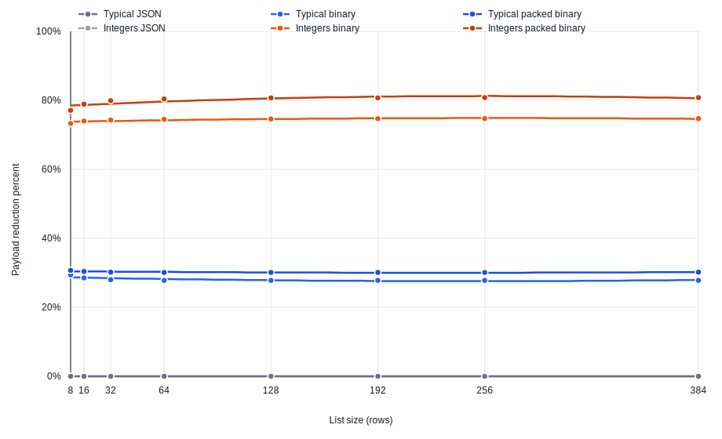

# Performance Guide

This guide is about the Telepact choices that most directly affect client-side
performance.

For a runnable benchmark that measures these tradeoffs with the Python runtime,
see [`example/py-performance`](../../example/py-performance/README.md).

The guidance below is intentionally concrete. The percentages come from the
current `example/py-performance` harness and are meant as expectation-setting,
not universal guarantees. Your exact results will depend on payload shape,
payload size, and link bandwidth.

## 1. Measure steady-state, not the binary handshake

Telepact binary is negotiated at runtime.

That means the very first binary-enabled request may carry extra bytes while the
client and server agree on the encoding. Do not treat that cold-start exchange
as your normal steady-state cost. Measure after negotiation has completed.

Use this rule of thumb:

- for one-off or very infrequent calls, plain JSON may be good enough
- for repeated calls between the same client and server, enable binary and judge
  the steady-state path after negotiation

The Python performance harness explicitly discards handshake samples before it
reports binary metrics.

## 2. Pick the highest-leverage option first

In practice, these optimizations usually stack in this order:

1. `@select_` to avoid sending fields the client does not need
2. runtime binary to reduce repeated key overhead and binary/base64 churn
3. packed-binary-friendly response shapes for list-of-struct workloads
4. `@unsafe_` only on trusted hot paths where skipping response validation is an
   intentional tradeoff

If you only adopt one thing, start with `@select_`. Removing unused fields helps
both JSON and binary callers and improves transfer time on every network.

## 3. What magnitude of gains to expect

The current Python harness shows these steady-state byte reductions relative to
plain JSON:

| Situation | Intervention | Typical gain seen in the harness |
| --- | --- | --- |
| Large dashboard / UI response | `@select_` | about **72% smaller** |
| Large mixed row batch | `@select_` | about **80% smaller** |
| Large integer-only row batch | `@select_` | about **66% smaller** |
| Large dashboard / nested typical payload | binary | about **46% to 51% smaller** |
| Large mixed row batch | binary | about **28% smaller** |
| Large flat string payload | binary | about **9% smaller** |
| Large integer-only row batch | binary | about **75% smaller** |
| Large mixed row batch | `@pac_` vs plain binary | about **3% smaller** |
| Large dashboard / nested payload | `@pac_` vs plain binary | about **5% smaller** |
| Large integer-only row batch | `@pac_` vs plain binary | about **24% smaller** |
| Large integer-only row batch | `@pac_` vs JSON | about **81% smaller** |
| Trusted hot path using `@unsafe_` | `@unsafe_` | **negligible in this harness**; usually within a couple of percent either way |

Two important takeaways:

- the biggest wins usually come from **not sending data** (`@select_`)
- the strongest `@pac_` case is a **large list of structs containing only
  integers**, because repeated field names disappear and the values themselves
  are already compact

If you want a simple rule of thumb:

- expect `@select_` to deliver **50% to 80%** gains when the client only needs a
  subset of a large response
- expect binary to deliver **30% to 50%** gains on many medium/large mixed
  payloads, but much less on string-heavy flat payloads
- expect `@pac_` to be **minor** for many mixed/nested shapes and **major** for
  large homogeneous row sets, especially integer-only rows

The harness now also renders a trend graph for list-heavy workloads. In the
current Python measurements:

- the **typical row** curves stay fairly flat as list size grows; binary stays
  around **28% to 29%** smaller than JSON and packed binary stays around
  **30% to 31%** smaller
- the **integer-only row** curves stay much higher; binary stays around
  **73% to 75%** smaller than JSON and packed binary stays around **77% to 81%**
  smaller
- the packed-binary advantage becomes easiest to justify when the list is both
  **large** and **structurally repetitive**, especially for integer-only rows

This SVG is a snapshot from the current Python harness and plots the six list
size trend series discussed above.

## 4. Payload size is not the whole story: serialization/deserialization tradeoffs

The Python harness also records client-side serialization and deserialization
times. That matters because some techniques reduce bytes while increasing codec
CPU time.

These numbers are from the current Python harness and compare each intervention
to plain JSON for the same scenario:

| Situation | Technique | Payload change | Serialize change | Deserialize change | What to expect |
| --- | --- | --- | --- | --- | --- |
| Large dashboard / partial-read UI response | `@select_` | **-72%** (19.2 KB -> 5.4 KB) | **+28%** (6.8 µs -> 8.6 µs) | **-61%** (88 µs -> 34.8 µs) | Slightly more request work because of the selection header, but much cheaper response decode because far less data comes back |
| Large dashboard / nested typical payload | binary | **-46%** (19.2 KB -> 10.3 KB) | **+50%** (6.8 µs -> 10.1 µs) | **+920%** (88 µs -> 898 µs) | Smaller wire payload, but the Python client pays much more decode cost than JSON here |
| Large mixed row batch | binary | **-28%** (39.8 KB -> 28.8 KB) | **+46%** (7.1 µs -> 10.3 µs) | **+881%** (107 µs -> 1,054 µs) | Byte savings help the network, but client decode work goes up substantially |
| Large mixed row batch | `@pac_` on binary | **-30%** (39.8 KB -> 27.8 KB) | **+117%** (7.1 µs -> 15.3 µs) | **+1,771%** (107 µs -> 2,010 µs) | Only a modest byte win over normal binary, but a noticeably larger codec cost |
| Large integer-only row batch | binary | **-75%** (70.0 KB -> 17.7 KB) | **+62%** (8.6 µs -> 14.0 µs) | **+930%** (429 µs -> 4,416 µs) | The wire-size gain is dramatic, but Python decode still becomes much slower |
| Large integer-only row batch | `@pac_` on binary | **-81%** (70.0 KB -> 13.4 KB) | **+128%** (8.6 µs -> 19.7 µs) | **+1,874%** (429 µs -> 8,465 µs) | This is the strongest packed-binary byte win, but also the clearest CPU tradeoff |
| Large flat string payload | binary | **-9%** (1.9 KB -> 1.7 KB) | **+47%** (4.9 µs -> 7.2 µs) | **+184%** (7.9 µs -> 22.5 µs) | Usually not worth it if your main goal is client-side codec speed |
| Trusted hot path | `@unsafe_` | roughly **0%** bytes | roughly **noise-level** client serialization change | roughly **noise-level** client deserialization change | Any benefit is mostly server-side validation work, not client codec work |

Two practical implications:

- `@select_` is the cleanest win when the client only needs part of the response,
  because it usually shrinks bytes **and** reduces response decode time even if
  request serialization gets a little slower
- binary and especially packed binary can be excellent **network** optimizations
  while still being poor **client codec** optimizations in the current Python
  harness; measure both before optimizing for the wrong bottleneck

## 5. Guidance by client situation

### Browser or mobile UI reading only part of a large response

Prefer:

- `@select_` on every partial-read request
- binary for repeated polling or interactive refreshes

Why:

- UI surfaces often need a thin slice of a server response
- `@select_` removes unnecessary fields before they hit the wire
- on higher-latency links, byte savings translate directly into better perceived
  latency

Expected magnitude:

- for large UI-shaped responses, `@select_` can easily cut bytes by **55% to
  72%**
- in the harness, a large dashboard dropped from about **19 KB** total to about
  **5.4 KB** with `@select_`
- in that same case, request serialization rose only slightly, from about
  **6.8 µs** to **8.6 µs**, while response deserialization fell from about
  **88 µs** to **34.8 µs**
- on the harness's regional 4G profile, that moved the same dashboard from about
  **62.7 ms** estimated wire time to about **57.2 ms**; the byte reduction is
  much larger than the latency reduction because that profile already carries a
  roughly **55 ms** round-trip floor

Typical fit:

- dashboards
- detail pages
- search/autocomplete side panels
- background refreshes on mobile networks

### Service-to-service calls with repeated medium or large payloads

Prefer:

- runtime binary by default
- JSON only when you truly need human-readable transport payloads or very cold,
  low-frequency calls

Why:

- the binary negotiation cost is amortized quickly on repeated traffic
- steady-state payloads are smaller and serialization work is usually lower

Expected magnitude:

- for medium/large mixed payloads, binary often saves roughly **30% to 50%**
- for very repetitive integer-heavy rows, binary can be much stronger; the
  harness saw about **75%** byte reduction on a large integer-only row batch
- for string-heavy flat payloads, expect much smaller gains; the harness saw
  only about **9%** on the large flat-string case
- in the current Python harness, these byte reductions often came with
  **materially slower client deserialization**, so binary is not automatically a
  client-CPU win

Typical fit:

- internal HTTP or WebSocket RPC
- queue or socket adapters that forward raw Telepact bytes
- repeated polling between long-lived peers

### Analytics or export-style responses with many repeated rows

Prefer:

- binary
- list-of-struct response shapes when they naturally represent the data
- `@pac_` when the caller and server are already using binary

Why:

- Telepact's packed binary path compresses repeated field names for list-of-struct
  payloads
- this is the strongest win when the rows are large, numerous, and structurally
  repetitive

Expected magnitude:

- for mixed row batches, `@pac_` may be modest; the harness saw only about
  **3%** additional savings over normal binary on the large mixed record batch
- for large integer-only row batches, `@pac_` is much more compelling; the
  harness saw about **24%** additional savings over normal binary and about
  **81%** savings versus JSON overall
- the trend graph in the harness makes this visible across list sizes: typical
  packed-binary rows stay near **30%** smaller than JSON, while integer-only
  packed-binary rows climb into the **high-70s to low-80s**
- in absolute terms, that large integer-only row batch fell from about **70 KB**
  total in JSON to about **17.7 KB** in binary and about **13.4 KB** in packed
  binary
- on the client-CPU side, packed binary was also the clearest tradeoff in the
  Python harness: that same integer-only case pushed deserialization from about
  **429 µs** in JSON to about **8,465 µs** in packed binary
- on the harness's regional 4G profile, that same case moved from about
  **83.0 ms** estimated wire time in JSON to about **62.1 ms** in binary and
  about **60.4 ms** in packed binary

Typical fit:

- tables
- feeds
- batched records
- history/event exports

### Trusted internal callers chasing the lowest server-side latency

Consider:

- `@unsafe_` on specific hot paths only after measuring

Why:

- it asks the server to skip response validation
- that can reduce steady-state latency for large responses
- it is a tradeoff: malformed responses are no longer blocked by the runtime

Expected magnitude:

- treat this as a possible **single-digit-percent** optimization, not a primary
  payload optimization
- in the current Python harness it was effectively noise-level on the client
  serialization/deserialization path, so do not lead with `@unsafe_` unless you
  have already measured validation cost in your own real path

Use it when all of the following are true:

- the caller is trusted
- the handler is mature and tightly controlled
- you already measured that validation is a meaningful part of the hot path
- you are comfortable giving up Telepact's normal hard-failure protection there

Avoid it for:

- untrusted callers
- newly developed handlers
- broad default client settings

## 6. Match the optimization to the transport

### Low-latency local or same-rack links

Focus first on CPU-side wins:

- `@select_` first when the client can skip fields
- binary only after checking codec cost in your runtime
- `@unsafe_` only if measurement proves validation cost matters

On very fast local links, RTT is already small, so byte-size savings matter less
than avoiding unnecessary serialization, deserialization, and validation work.

### Typical office, Wi-Fi, or regional mobile links

Focus first on payload size:

- `@select_`
- binary
- packed-friendly row responses

Here, size savings often improve both throughput and tail latency.

Expected magnitude:

- `@select_` and binary savings tend to matter most here because bandwidth is
  limited enough for byte reductions to show up directly in transfer time
- a large 19 KB dashboard dropping to 5.4 KB cut the harness's regional-4G
  estimate by about **5.5 ms**
- a large 70 KB integer-row batch dropping to 13.4 KB cut the same profile by
  about **22.6 ms**

### Cross-country or intercontinental links

Focus on anything that removes bytes from large steady-state responses:

- `@select_`
- binary
- packed row shapes

Distance dominates the RTT floor, but smaller payloads still help once the
response is large enough or the available bandwidth is limited.

Expected magnitude:

- byte savings still help, but they shift a smaller share of total latency than
  on slower regional links
- in the harness, cutting a large dashboard from 19 KB to 5.4 KB only moved the
  intercontinental estimate by about **2.2 ms**
- by contrast, the large integer-row batch still moved by about **9.1 ms**
  because the payload itself was much larger

## 7. Practical recommendations

- default to JSON for the simplest cold-start integrations and debugging-first
  workflows
- switch to binary when the same client/server pair talks repeatedly **and**
  network size matters more than local codec cost
- design list-heavy result sets as arrays of structs so packed binary can help
- if those rows are mostly or entirely integers, strongly consider `@pac_`; that
  is where the most dramatic packed-binary wins show up
- use `@select_` for read paths where clients only need a subset of fields
- reserve `@unsafe_` for measured, trusted, internal hot paths
- benchmark with your real payload shapes, not synthetic scalars only

## 8. What to measure in your own environment

At minimum, capture:

- steady-state request bytes
- steady-state response bytes
- serialization/deserialization time
- end-to-end request latency
- separate results for small and large payloads
- separate results for flat, string-heavy, number-heavy, and row-heavy shapes

That gives you enough evidence to decide whether the next win comes from
selection, binary, packed binary, or validation skipping.
